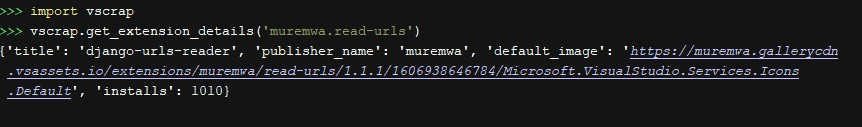
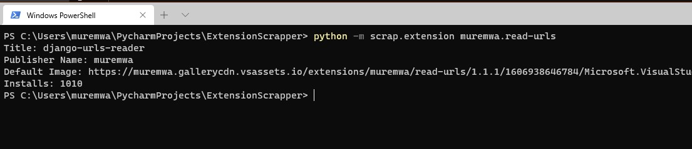

# Visual Studio Marketplace Scraper.
Get the details of an extension from `marketplace.visualstudio.com`.  
Details are:
1. Extension title: `title: STRING`
2. Extension publisher name: `publisher_name: STRING`
3. Extension main image/logo: `default_image: URL`
4. Number of installs: `installs: INTEGER`    

All you need is the extension ID eg: `muremwa.read-urls`  
The extension ID is called the __'Unique Identifier'__.

## Installation
You can install using pip.
```commandline
pip install marketplace-scrapper
```

## Usage
### In python code.  
Import the main function.
```python
import vscrap

details = vscrap.get_extension_details('muremwa.read-urls')

```
The main function returns a dict with the details as described above.




### In command line
Use the ``scrap.extension`` module and add one argument, the extension ID.
 
 ```commandline
python -m scrap.extension muremwa.read-urls
```


